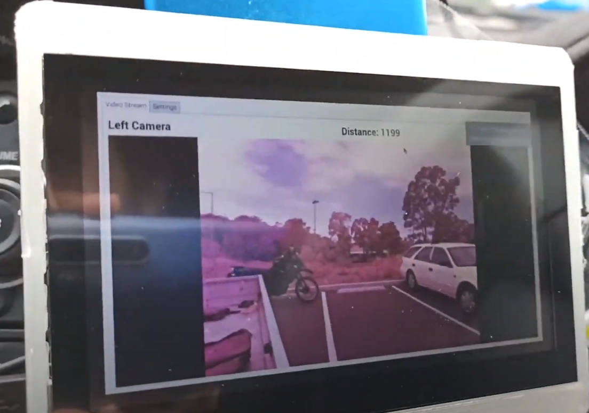
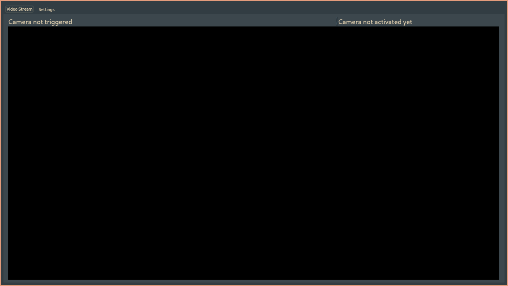

# Overview
The Truck Hazard Detection System is created by XIV Consulting. It is a modular system which provides additional safety features for older trucks.

{ width=50% }

{ width=50% }

The code for the project resides at [TruckHazardDetection](https://github.com/brokenax3/TruckHazardDetection). Bug reports and suggestions are welcome. The wiki provides troubleshooting guides and setup.

# Features
- Auto-start
- Loading and Saving Configuration on Boot
- Automatic Camera Switching
- Distance Detection
- Easy Configuration with User Interface

# Quick Start
1. Input desired Camera Stream URL according to the instructions provided in the Settings Tab.
2. Select the Camera that was set up and tick the camera in the Activation Box.
3. Apply and Save the configured settings and return to the Video Stream Tab.

# Changelog
- 18-10-2020
    - Attempt at implementing activating camera via bash scripting
        - QProcess::start() is depreciated
    - Autostart script
    - More instructions on installation process
- 17-10-2020
    - Video player optimisations
    - Streams not playing smoothly is an issue with the streamer, not the client.
        - Tested with RTSP stream test and hosting VLC stream and video and audio was playing as expected
    - Fixed some problems with code
    - Update dependencies list
- 16-10-2020
    - Re-Implemented some UI elements
    - Auto-switching now works with Left and Right Camera
    - Enable setting, saving and applying two cameras
    - Distance displaying improvements
    - Quick start instructions
    - FileWatcher works
    - Code clean-up 
- 15-10-2020
    - Implemented Automatic switching with Photoresistor
    - Reverted FileWatcher as it breaks automatic video stream displaying (GStreamer Error)
- 14-10-2020
    - Removed press to play and stop button for automatic switching
    - Implemented Filewatcher to monitor the contents of a file to switch camera feeds
    - Changed Distance label to show actual distance provided from MQTT server
- 29-08-2020
    - Initial Backup
